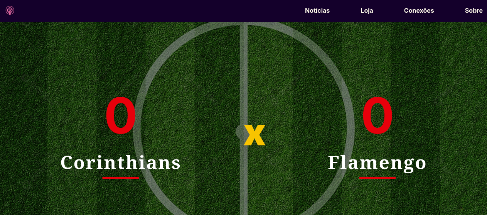
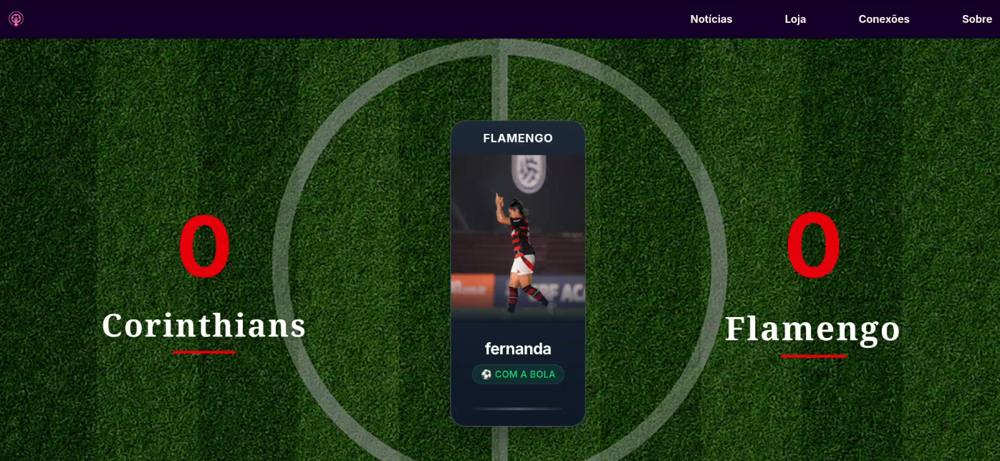
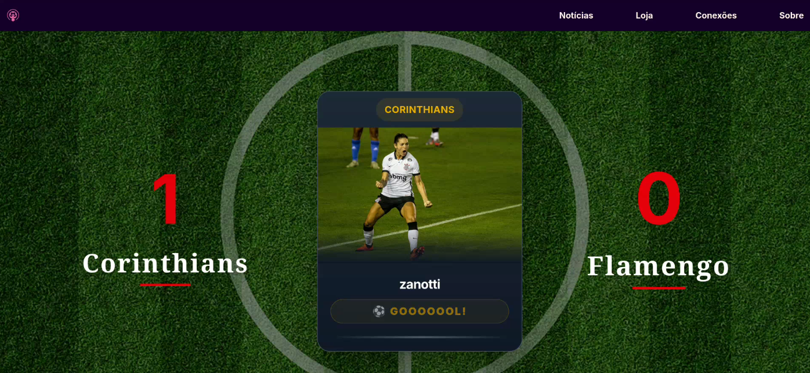

# SPRINT 4 - Ecossistema Tech PBS02

## 👥 **Desenvolvido Por**
| Nome | RM |
|------|----|
| Carlos Eduardo Sanches Mariano | 561756 |
| Leonardo Eiji Kina | 562784 |
| Luís Scacchetti Mariano | 562241 |
| Rodrigo do Santos Abubakir | 561479 |
| Vitor Ramos de Farias | 561958 |

## 💡 **Contexto e Problema**
O futebol feminino enfrenta desafios significativos devido à falta de investimento em infraestrutura para coleta de dados. Essa carência de informações confiáveis impacta diretamente na valorização do esporte e impede análises de desempenho aprofundadas.

## 🎯 **Nossa Solução**
A **Synapse** desenvolveu uma solução acessível e eficiente que fornece dados de jogo em tempo real, permitindo análises detalhadas do desempenho das atletas e equipes. Integrado ao portal **Passa a Bola**, nosso sistema facilita o acesso a informações confiáveis, demonstrando o valor e potencial das atletas e aumentando a visibilidade do esporte.

---

## ⚙️ **Arquitetura do Sistema**

### 🔄 **Fluxo de Dados**
1. **📡 Captura** → Coleta de coordenadas via dispositivos IoT
2. **📨 MQTT** → Distribuição de mensagens em tempo real
3. **🐍 Python** → Processamento e cálculos de proximidade
4. **🟨 Node-RED** → Estruturação de dados e WebSocket
5. **⚛️ React** → Visualização em tempo real via WebSocket

### 🏗️ **Componentes Técnicos**

#### **📍 Coleta de Coordenadas**
- **Bola**: Posicionamento preciso em campo
- **Gol**: Coordenadas exatas das traves
- **Jogadoras**: Localização individual com identificação por nome e time

#### **📡 Transmissão MQTT**
- **Broker**: Mosquitto
- **Protocolo**: MQTT para comunicação assíncrona
- **Vantagens**: Baixa latência e eficiência em tempo real

#### **🔌 WebSocket - Comunicação em Tempo Real**
- **Protocolo**: WebSocket para atualizações instantâneas
- **Funcionamento**: Conexão persistente bidirecional
- **Vantagem**: Dados chegam instantaneamente sem necessidade de polling ou refresh

**⚡ Como funciona o WebSocket:**
```
Cliente: "Olá, quero conexão WebSocket"
Servidor: "Conexão estabelecida! ✅"

[CONEXÃO PERMANECE ABERTA]

Servidor: ⚽ "GOL do Corinthians!"
[INSTANTÂNEO] → Cliente recebe e atualiza placar

Servidor: 🔵 "Posse: Flamengo"  
[INSTANTÂNEO] → Cliente recebe e mostra posse
```

**🎯 Benefícios para o Sistema:**
- ✅ **Atualizações instantâneas** - Gols aparecem imediatamente
- ✅ **Zero polling** - Não fica solicitando dados repetidamente
- ✅ **Conexão eficiente** - Menos tráfego de rede
- ✅ **Experiência real-time** - Como transmissões esportivas profissionais

#### **🧮 Processamento Inteligente**

**🎯 Cálculo de Posse de Bola**
```json
{
  "nome": "Nome da Jogadora",
  "time": "Time", 
  "tipo": "possession"
}
```
- Distância calculada em metros entre jogadoras e bola
- Posse identificada quando distância < 1,5 metros

**⚽ Detecção de Gol**
- Cálculo de distância entre bola e gol
- Identificação do último jogador com posse antes do gol
- Publicação automática de evento de gol via WebSocket

#### **🐍 Processamento Python**
- **Algoritmo Principal**: Cálculo de Proximidade Euclidiana
- **Fórmula**: `√((x₂ - x₁)² + (y₂ - y₁)²)`
- **Aplicação**: Posicionamento de jogadoras e análise de movimentos

#### **🟨 Node-RED (WebSocket Layer)**
- Conversão MQTT → WebSocket
- Estruturação de dados em JSON
- Gerenciamento de fluxo em tempo real
- Broadcasting para todos os clientes conectados

---

## 🚀 **Novidades da Versão**

### **🆕 Melhorias Implementadas**
- ✅ **Servidor próprio otimizado** para melhor performance
- ✅ **Cálculos mais precisos** com algoritmos refinados
- ✅ **Transmissão de dados aprimorada** para maior confiabilidade
- ✅ **Interface mais intuitiva** no frontend
- ✅ **Processamento mais eficiente** de eventos em tempo real
- ✅ **Mais simples e escalável**
- ✅ **WebSocket integrado** para atualizações em tempo real
- ✅ **Eliminação completa do HTTP** para dados em tempo real

### **🔄 Arquitetura Simplificada:**
```
Dispositivos IoT → MQTT → Python → Node-RED → [WebSocket] → React
                                                      ↓
                                         Atualização Instantânea
```

---

## 🛠️ **Como Executar**

### **Pré-requisitos**
- Máquina virtual
- Docker-compose instalado

### **🚀 Execução do Sistema Backend**
1. **Baixe a pasta `tef_soccer`** presente neste repositório em sua vm
2. **Execute os comandos:**
```bash
cd tef_soccer
sudo docker-compose up -d
```
3. **Pronto!** O sistema backend está rodando

### **⚙️ Configuração do Node-RED**
1. **Acesse o Node-RED** no endereço: `http://seu-ip:1880`
2. **Importe o fluxo:**
   - Vá em Menu → Import
   - Selecione o arquivo `flows.json` do repositório
3. **Configure o Broker MQTT:**
   - Abra as configurações dos nós MQTT
   - Altere o IP do broker para o IP do seu servidor
   - Clique em "Update" e depois "Deploy"

### **🌐 Execução do Frontend**
1. **Clone o repositório** do frontend
2. **Instale as dependências:**
```bash
cd frontend
npm install
```
3. **Execute o projeto:**
```bash
npm run dev
```

### **🔌 Verificação do WebSocket**
O frontend usa WebSocket automaticamente. Para verificar:

1. **Abra o console do navegador** (F12)
2. **Procure por:** `"Conectado ao WebSocket"`

### **🖼️ Configuração das Imagens**
Caso não estejam aparecendo imagens das jogadoras:
- Adicione as imagens na pasta `public`
- Nomeie os arquivos com letras minúsculas
- Use o mesmo nome enviado pelo dispositivo
- Formato: `.jpg` (ex: `zanotti.jpg`, `fernanda.jpg`)

### **🧪 Teste do Sistema**

#### **Opção 1: Com Componentes Físicos**
- Baixe os arquivos `.ino` da pasta `device` deste repositório
- Faça o upload no seu microcontrolador

#### **Opção 2: Simulação via MyMQTT**
- Baixe o aplicativo **MyMQTT** no celular
- Conecte ao seu servidor MQTT (use o IP do seu servidor)
- Envie coordenadas manualmente usando os tópicos:

**📨 Tópicos para Teste:**
```
Tópico: /TEF/device/sc
Mensagem: -23.545556,-46.473889,Corinthians,zanotti

Tópico: /TEF/device/sc
Mensagem: -23.545551,-46.473885,Flamengo,fernanda

Tópico: /TEF/device/b  
Mensagem: -23.545556,-46.473889

Tópico: /TEF/device/g
Mensagem: -23.545556,-46.473889
```

---

## 📊 **Resultados Esperados**

### **🎯 Demonstração do Sistema em Funcionamento**

#### **1. Acesso à Aplicação**


*A interface principal mostra o campo de futebol com visualização em tempo real das jogadoras, bola e estatísticas do jogo.*

#### **2. Detecção de Posse de Bola**


*Quando uma jogadora está a menos de 1,5m da bola, o sistema automaticamente:*
- ✅ **Identifica a posse** com nome e time da jogadora
- ✅ **Mostra visualmente** quem está com a posse

#### **3. Detecção Automática de Gol**


*Quando a bola entra no gol, o sistema instantaneamente:*
- ⚽ **Identifica o gol** através do cálculo de proximidade
- 👤 **Reconhece a artilheira** (última jogadora com posse)
- 🎯 **Atualiza o placar** em tempo real via WebSocket

---

## 🏆 **Impacto e Conclusão**

### **✅ Benefícios Alcançados**
- **🎯 Maior visibilidade** do futebol feminino através de dados concretos
- **📊 Análise profissional** acessível para clubes de todos os portes
- **⚡ Tecnologia em tempo real** comparável a transmissões profissionais
- **💰 Solução econômica** utilizando IoT e código aberto

*Sistema desenvolvido para a Sprint 4 - Ecossistema Tech PBS02*  
